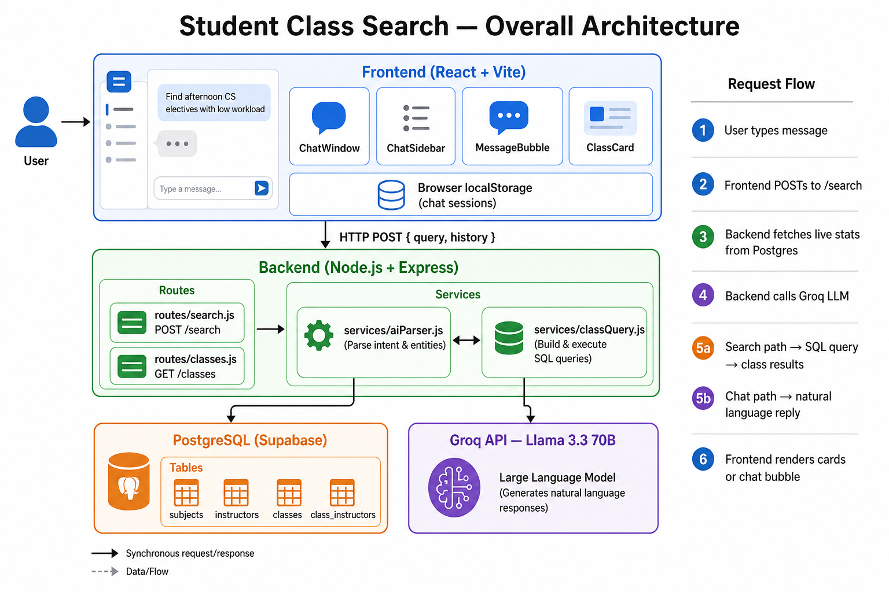
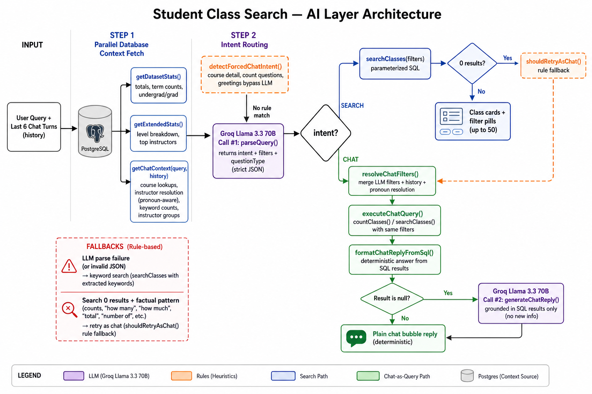

# Architecture & Design Write-up

## Architecture

The system has three tiers: a React chat UI, an Express API, and a Postgres database (Supabase), with an AI layer that routes each message to either a **search** or **chat** path.

Request flow:
1. User types a message in the chat UI.
2. Frontend POSTs `{ query, history }` to `/search`, where `history` is the last few turns of the conversation (kept in React state and persisted in browser `localStorage`).
3. Backend fetches live dataset stats, extended stats, and query-specific context from Postgres in parallel.
4. Backend classifies the message (rules first, then Groq Llama 3.3 70B) as either a **class search** or a **conversational/factual question**.
5. If `intent: "search"`, the backend runs parameterized SQL from extracted filters and returns matched classes. If zero results and the question looks factual, it retries as chat.
6. If `intent: "chat"`, the backend runs SQL via the same filter engine (**chat-as-query**), formats a deterministic reply from the results, and only calls the LLM a second time if phrasing is needed.
7. The frontend renders either filter pills + class cards, or a plain chat bubble, depending on which path was taken.

## Why this stack

- **Postgres/Supabase**: the data is inherently relational — a class has a subject, can have multiple instructors, and recurs across terms — so a normalized relational schema fits better than a document store. Free tier, and SQL is easy.
- **Express**: minimal and fast to wire up for three small route files without unnecessary abstraction.
- **React + Vite**: fast dev loop for a single-page chat UI with no build complexity needed.
- **Groq (Llama 3.3 70B) over a paid API**: free tier with generous limits, OpenAI-compatible API, and fast inference — appropriate for a prototype.
- **Chat-as-query**: factual answers come from SQL, not LLM memory — the model interprets intent and phrasing, but Postgres is the source of truth for all numbers and course details.

## How the AI search and chat layer works

### Step 1 — Database context fetch (before any LLM call)

In parallel, the backend loads:
- **`getDatasetStats()`** — total classes, instructors, undergrad/grad counts, term counts
- **`getExtendedStats()`** — level breakdown, top instructors by class count
- **`getChatContext(query, history)`** — course code lookups, instructor resolution (including pronoun follow-ups from recent history), keyword match counts, combined filter counts, instructor group summaries

### Step 2 — Intent routing

**Rule-based routing (first):**
- `detectForcedChatIntent()` catches questions that should never be search — e.g. prerequisites for a course code, "how many courses" count questions, greetings
- Skips the LLM entirely for these cases

**LLM Call #1 — `parseQuery()`:**
- Sends query, history, stats, and pre-fetched context to Groq with a strict JSON schema
- Returns `intent: "search"` with extracted filters, or `intent: "chat"` with `questionType` (`count`, `list`, `detail`, `general`) and filters
- On failure → falls back to keyword search

### Step 3a — Search path

- `searchClasses(filters)` runs parameterized SQL (subject, instructor, term, level, undergrad/grad, keyword)
- Returns up to 50 matching class cards with filter pills
- **`shouldRetryAsChat()`** — if search returns 0 results but the question is clearly factual (e.g. misclassified prereq question), retries as chat

### Step 3b — Chat path (chat-as-query)

- **`resolveChatFilters()`** — merges LLM-extracted filters with instructors/courses resolved from query + history; pronoun follow-ups ("he", "she") resolve to the **most recently mentioned** instructor
- **`executeChatQuery()`** — runs `countClasses()` and/or `searchClasses()` with the same filters; for instructor questions, computes undergrad/grad breakdowns
- **`formatChatReplyFromSql()`** — builds the reply directly from SQL results (deterministic, no hallucination)
- **LLM Call #2 — `generateChatReply()`** (fallback only) — rephrases SQL results naturally for questions the formatter cannot handle (e.g. "what does REST mean?")

### Follow-up and context handling

- Up to the last **6 turns** of conversation history are sent to the backend
- Search result summaries in history include course codes and undergrad/grad labels
- Pronoun references resolve from the **most recent** instructor mention, not the entire conversation
- Each chat session is isolated — context does not leak across chats in the sidebar

### Reliability guarantees

| Scenario | Handling |
|----------|----------|
| LLM parse failure | Keyword search fallback |
| Misclassified factual question as search | `shouldRetryAsChat()` rule fallback |
| Course detail question (prereqs, units) | `detectForcedChatIntent()` forces chat |
| Pronoun follow-up after multiple instructors | Most-recent instructor wins |
| Factual numbers | Always from SQL, never invented by LLM |

## Future Enhancements

- Persist conversation history server-side per session for multi-device continuity.
- Add a "did you mean" correction layer for misspelled instructor names or course codes.
- Add guardrails for sensitive information — filter input and output to block attempts to extract system prompts, credentials, or other internal data.
- Add automated tests for the intent classification, filter extraction, and SQL-building logic.
